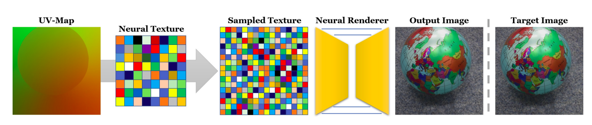

# Deferred Neural Rendering Training


Once the data is preprocessed, we can now train the model and infer from it. Instructions are given below:

## Training
```
python train.py --data <data_dir> --checkpoint <ckpt_dir> --logdir <log_dir> --epoch 100  \
	--load <lif_ckpt_load_path> --load_step <lif_ckpt_epoch> --mask_load <mask_ckpt_load_path> --mask_load_step <mask_ckpt_epoch>
```
You can tweak other parameters like `batch_size`, etc in `config.py` 
## Inference
+ For real scenes
```
python render_network.py --data <data_dir> --lif_checkpoint <lif_ckpt_path> --mask_checkpoint <mask_ckpt_path> --output_dir <output_path> --material <input_material>
```

This implementation is an unofficial version of [Zp Zhou](https://github.com/SSRSGJYD). The code can be found [here](https://github.com/SSRSGJYD/NeuralTexture)