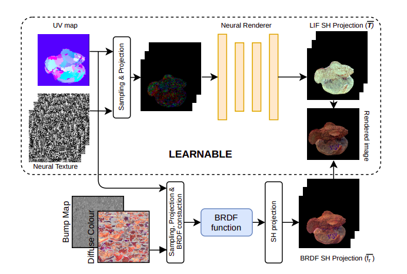

# Independent Estimation Training



Once the data is preprocessed, we can now train the model and infer from it. Note you must have the diffuse texture optimized already for this to work. Instructions are given below:

## Training
```
python train.py --data <data_dir> --checkpoint <ckpt_dir> --logdir <log_dir> --epoch 100  \
	--load <lif_ckpt_load_path> --load_step <lif_ckpt_epoch> --mask_load <mask_ckpt_load_path> --mask_load_step <mask_ckpt_epoch>
```
You can tweak other parameters like `batch_size`, etc in `config.py` 
## Inference
+ For real scenes
```
python render_network_real.py --data <data_dir> --lif_checkpoint <lif_ckpt_path> --mask_checkpoint <mask_ckpt_path> --output_dir <output_path> --material <input_material>
```
+ For synthetic scenes
```
python render_network_synthetic.py --data <data_dir> --lif_checkpoint <lif_ckpt_path> --mask_checkpoint <mask_ckpt_path> --output_dir <output_path> --material <input_material>
```
You can the LIF at a given pixel value for synthetic scenes. Choose the point with normal facing upward.
