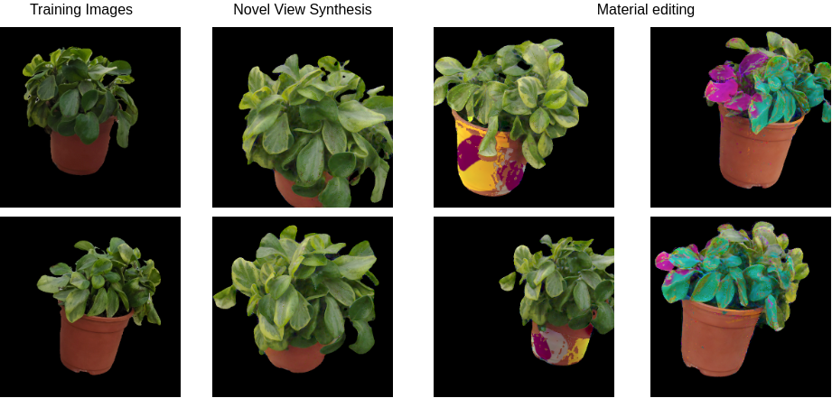

<h1 align="center">A Flexible Neural Renderer for Material Visualization</h1>

<b>ArXiv</b>

  
    <a href="https://darthgera123.github.io/">Pulkit Gera1</a>,
    <a href="https://aakashkt.github.io/">Aakash KT1</a>,
    <a href="https://github.com/thesigmaguy">Dhawal Sirikonda1</a>,
    <a href="https://scholar.google.co.in/citations?user=3HKjt_IAAAAJ&hl=en">P J Narayanan1</a>
  

1CVIT, IIIT Hyderabad

  
    <a href="https://darthgera.github.io/publications/appearance-editing">[Project page]</a>
    <a href="https://dl.acm.org/doi/abs/10.1145/3490035.3490299">[Paper]</a>
    <a href="https://youtu.be/ZCVQj5FK0C4">[Video]</a>
    <a href="">[bibtex]</a>
  

<b>Abstract</b> 
  We present a neural rendering framework for simultaneous view synthesis and appearance editing of a scene from
  multi-view images captured under known environment illumination. Existing approaches either achieve view synthesis alone or view synthesis along with relighting, without direct control over the scene’s appearance. Our approach explicitly disentangles the appearance and learns a lighting representation that is independent of it. Specifically, we  independently estimate the BRDF and use it to learn a lighting-only representation of the scene. Such disentanglement allows our approach to generalize to arbitrary changes in appearance while performing view synthesis. We show results of editing the appearance of a real scene, demonstrating that our approach produces plausible appearance editing. The performance of our view synthesisapproach is demonstrated to be at par with state-of-the-art
  approaches on both real and synthetic data.

# Code Instructions
## Prerequisites
This code was tested on UBuntu 20.04, with Python 3.8.  

<b>Python 3.8 dependencies:</b> 
torch-1.7.0 (pytorch) 
torchvision-0.0.9 
pillow-5.1.0 
numpy-1.13.3 
opencv-python-4.1.0.25 

## Curating the Data
Check data_gen
## Preprocess the Data
Check preprocess
## Running code

## Training Data
Contact the authors for Training Data. The 4 datasets : Woman, Plants, Fish and Cushion will be made available soon.